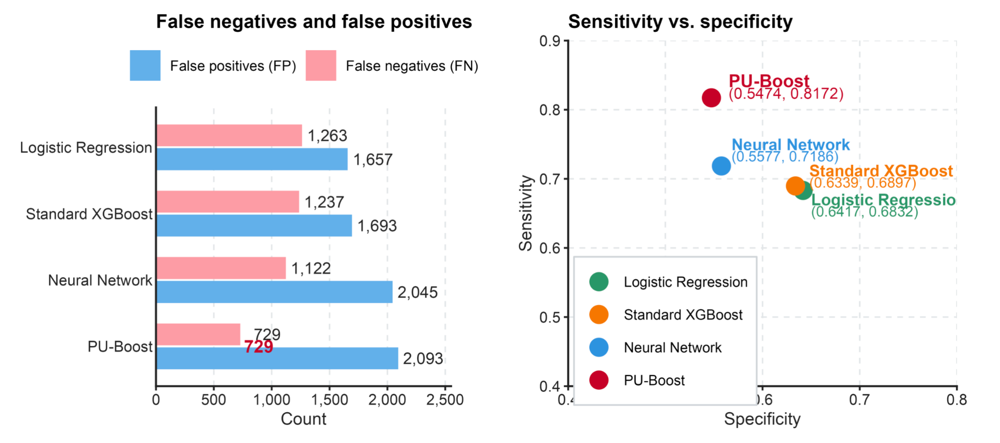

# PU-Boost

### A Two-Stage Reliable-Sample Reconstruction Positive-Unlabeled Learning Framework for Screening Undiagnosed Hypertension

PU-Boost is a two-stage positive-unlabeled (PU) learning framework designed to reconstruct reliable supervision from ambiguous clinical labels.

Instead of treating all individuals without a prior hypertension diagnosis as negative, PU-Boost explicitly models them as an **unlabeled mixture of hidden positives and true negatives**. The framework progressively identifies high-confidence samples, refines uncertain observations, rejects persistently ambiguous cases, and trains the final classifier on the reconstructed dataset.

---

## Screening-Oriented Performance

<p align="center">
  <a href="figures/figure7_performance.png">
    
  </a>
</p>


<p align="center">
  <b>Test-set error profiles and sensitivity–specificity operating points.</b>
</p>

On the independent test set (`n = 8,611`), PU-Boost achieved the strongest screening-oriented performance among the compared models.

| Model | Sensitivity | Specificity | Balanced Accuracy | False Negatives |
|---|---:|---:|---:|---:|
| Logistic Regression | 0.6832 | 0.6417 | 0.6624 | 1,263 |
| Standard XGBoost | 0.6897 | 0.6339 | 0.6618 | 1,237 |
| Neural Network | 0.7186 | 0.5577 | 0.6382 | 1,122 |
| **PU-Boost** | **0.8172** | 0.5474 | **0.6823** | **729** |

### Key Gains

Compared with standard XGBoost:

- **Sensitivity:** 0.6897 → **0.8172**
- **Absolute sensitivity gain:** **+0.1275**
- **False negatives:** 1,237 → **729**
- **Missed cases reduced by 41.1%**
- **508 additional reference-positive participants identified**
- **Balanced accuracy:** 0.6618 → **0.6823**

The main gain is intentionally screening-oriented. PU-Boost substantially reduces missed positive cases while accepting a lower specificity.

---

# Mathematical Formulation

## 1. Positive-Unlabeled Learning Setting

Let:

- `Y ∈ {0,1}` denote the reference hypertension status
- `S ∈ {0,1}` denote the observable prior-diagnosis label
- `X` denote the predictor vector

The clinically relevant screening target is:

```math
\Pr(Y=1 \mid X)
```

whereas directly learning from diagnosis status targets:

```math
\Pr(S=1 \mid X)
```

Under the reliable-positive assumption:

```math
S=1 \Rightarrow Y=1
```

we have:

```math
\Pr(S=1\mid X)
=
\Pr(Y=1\mid X)
\Pr(S=1\mid Y=1,X)
```

Define:

```math
c(X)=\Pr(S=1\mid Y=1,X)
```

Then:

```math
\Pr(S=1\mid X)
=
c(X)\Pr(Y=1\mid X)
```

Therefore, learning the observable diagnosis label is not necessarily equivalent to learning the underlying disease risk.

In this study:

```math
P=A
```

where `A` represents previously diagnosed hypertension cases.

The unlabeled population is:

```math
U=B\cup C
```

where:

- `B`: undiagnosed hypertension
- `C`: non-hypertension

The reference identities of `B` and `C` are hidden from the two-stage PU reconstruction algorithm.

---

# Two-Stage Reliable-Sample Reconstruction

## Stage 1 — Global Ranking with Elastic Net

Elastic Net logistic regression is fitted using the observable P/U labels.

For participant `i`, the Stage-1 score is:

```math
q_i
=
f_1(X_i)
=
\Pr(S_i=1\mid X_i)
=
\frac{1}
{1+\exp[-(\beta_0+X_i^\top\beta)]}
```

The score measures the extent to which an observation resembles the labeled-positive population and is used for ranking and stratification.

The Elastic Net parameters are estimated through the penalized objective:

```math
(\widehat{\beta}_0,\widehat{\beta})
=
\mathrm{argmin}_{\beta_0,\beta}
\left\{
-\frac{1}{n}
\sum_{i=1}^{n}
\left[
S_i\log q_i
+
(1-S_i)\log(1-q_i)
\right]
+
\lambda
\left[
\alpha\|\beta\|_1
+
\frac{1-\alpha}{2}\|\beta\|_2^2
\right]
\right\}
```

where:

```math
\|\beta\|_1
=
\sum_{j=1}^{p}|\beta_j|
```

and:

```math
\|\beta\|_2^2
=
\sum_{j=1}^{p}\beta_j^2
```

The regularization parameter `λ` controls the overall penalty strength, while `α` controls the relative contributions of L1 and L2 regularization.

The pair `(α, λ)` is selected by 10-fold cross-validation.

```math
CV(\alpha,\lambda)
=
\frac{1}{K}
\sum_{k=1}^{K}
L_k(\alpha,\lambda),
\qquad
K=10
```

The selected parameters satisfy:

```math
(\widehat{\alpha},\widehat{\lambda})
=
\mathrm{argmin}_{\alpha,\lambda}
CV(\alpha,\lambda)
```

Two training-internal thresholds partition the Stage-1 observations:

```math
\widetilde{Z}_i^{(1)}
=
\begin{cases}
P_1, & q_i \geq t_H^{(1)}, \\
N_1, & q_i \leq t_L^{(1)}, \\
U_1, & t_L^{(1)} < q_i < t_H^{(1)}.
\end{cases}
```

where:

- `P₁`: high-confidence candidate positives
- `N₁`: high-confidence candidate negatives
- `U₁`: uncertain observations

The Stage-1 thresholds are constructed from empirical score quantiles:

```math
t_H^{(1)}
=
Q_{1-\alpha_1}
\left(
\{q_i : i\in P\}
\right)
```

and:

```math
t_L^{(1)}
=
Q_{\beta_1}
\left(
\{q_i : i\in U\}
\right)
```

### Observed Stage-1 Partition

| Set | n |
|---|---:|
| P₁ | 5,313 |
| N₁ | 2,144 |
| U₁ | 18,426 |

Thus, 18,426 observations remained uncertain after the global Elastic Net ranking and were passed to Stage 2.

---

## Stage 2 — Nonlinear Refinement with Random Forest

Only the uncertain set `U₁` enters Stage 2.

A Random Forest is trained using the high-confidence samples retained from Stage 1:

```math
D_1
=
P_1\cup N_1
```

The Stage-1 pseudo-labels are:

```math
Z_i^{(1)}
=
\begin{cases}
1, & i\in P_1, \\
0, & i\in N_1.
\end{cases}
```

For observations in `U₁`, the second-stage score is:

```math
r_i
=
f_2(X_i),
\qquad
i\in U_1
```

The uncertain population is then partitioned as:

```math
\widetilde{Z}_i^{(2)}
=
\begin{cases}
P_2, & r_i \geq t_H^{(2)}, \\
N_2, & r_i \leq t_L^{(2)}, \\
R, & t_L^{(2)} < r_i < t_H^{(2)}.
\end{cases}
```

where `R` is a **reject set** containing observations that remain highly ambiguous after both stages.

The Stage-2 thresholds are defined from the corresponding training-score distributions:

```math
t_H^{(2)}
=
Q_{1-\alpha_2}
\left(
\{r_i : i\in P_1\}
\right)
```

and:

```math
t_L^{(2)}
=
Q_{\beta_2}
\left(
\{r_i : i\in N_1\}
\right)
```

### Observed Stage-2 Partition

| Set | n |
|---|---:|
| P₂ | 2,704 |
| N₂ | 5,873 |
| Reject set R | 9,849 |

The reject set is excluded from the final supervised loss rather than being forced into potentially unreliable pseudo-labels.

---

# Final Reconstructed Training Set

The retained positive candidates are:

```math
D_P
=
P_1\cup P_2
```

The retained negative candidates are:

```math
D_N
=
N_1\cup N_2
```

The final pseudo-label is:

```math
\widetilde{Y}_i
=
\begin{cases}
1, & i\in D_P, \\
0, & i\in D_N.
\end{cases}
```

This reconstruction yields:

- **8,017 pseudo-positive observations**
- **8,017 pseudo-negative observations**
- **16,034 observations retained**
- **9,849 highly ambiguous observations rejected**
- **61.9% of the original training set retained**
- **38.1% rejected as highly uncertain**

The final reconstructed dataset is therefore class-balanced.

The retained samples are then used to train the final **XGBoost classifier**.

---

# Why Two Stages?

The PU-Boost architecture separates three statistical roles.

### 1. Global Regularized Ranking

Elastic Net provides a stable global ranking under noisy P/U supervision.

### 2. Local Nonlinear Refinement

Random Forest focuses specifically on the uncertain region where a linear decision structure may be insufficient.

### 3. Uncertainty Rejection

Observations that remain ambiguous after both stages are not forced into binary pseudo-labels.

The overall procedure can be summarized as:

```math
\text{Global ranking}
\rightarrow
\text{Uncertain-region refinement}
\rightarrow
\text{Rejection}
\rightarrow
\text{Final supervised learning}
```

Rather than assigning labels to every unlabeled observation, PU-Boost trades training-set size for higher-confidence supervision.

---

# Final Classifier

After the two-stage reconstruction, XGBoost is trained on the reconstructed sample:

```math
\{X_i,\widetilde{Y}_i\}
```

to learn the final nonlinear decision function:

```math
g(X)
```

The recorded final XGBoost hyperparameters were:

| Hyperparameter | Value |
|---|---:|
| max_depth | 3 |
| learning_rate | 0.06 |
| min_child_weight | 5 |
| subsample | 0.5 |
| colsample_bytree | 0.6 |

The primary classification threshold was fixed at:

```math
0.5
```

The resulting output is interpreted primarily as a ranking and classification score rather than as an absolute population disease probability unless additional calibration is performed.

---

# Model Interpretation

SHAP analysis was used to quantify feature contributions to the final PU-Boost output.

Leading contributors included:

- Age
- Body mass index
- Waist circumference
- Maternal hypertension history
- Paternal hypertension history
- Snoring
- Dyslipidemia
- Stroke history
- Current smoking
- Diabetes

These variables are broadly consistent with established clinical and epidemiologic characteristics associated with hypertension.

SHAP values are used for **model attribution and interpretation** and should not be interpreted as causal effects.

---

# Study Population

The analytic cohort included **43,105 adults aged 45 years or older**.

The data were divided into:

| Dataset | n |
|---|---:|
| Training | 25,883 |
| Validation | 8,611 |
| Test | 8,611 |
| **Total** | **43,105** |

The independent test set contained:

- **3,987 reference-positive participants**
- **4,624 reference-negative participants**

Direct blood-pressure measurements were used to define the reference disease status but were excluded from model predictors.

---

# Reference Label Structure

Participants were retrospectively divided into three groups:

| Group | Definition | n | PU Role |
|---|---|---:|---|
| A | Diagnosed hypertension | 13,287 | Labeled positive |
| B | Undiagnosed hypertension | 9,393 | Unlabeled |
| C | Non-hypertension | 20,425 | Unlabeled |

Thus:

```math
P=A
```

and:

```math
U=B\cup C
```

During PU reconstruction, the model observes only the distinction between `P` and `U`.

The reference identities of `B` and `C` are not provided to the two-stage reconstruction algorithm. They are used only outside the reconstruction procedure for model selection, interpretation, and final performance evaluation.

---

# Manuscript Status

A PDF version of this study is available in this repository for reference.

The manuscript is currently **under submission for peer review**.

---

# Authors

**Huanqi Wu**  
University of Arizona  
huanqiwu@arizona.edu

**Liangkun Shi**  
University of Arizona  
liangkuns@arizona.edu

**Hanfei Yang**  
University of Arizona  
yanghanfei@arizona.edu

**Lizhu Guo**  
Beijing Anzhen Hospital, Capital Medical University  
azguolizhu@gmail.com

---

# Citation

A formal citation will be added after the manuscript or preprint becomes publicly available.

---

# Disclaimer

PU-Boost is intended as a screening and risk-stratification framework rather than a replacement for confirmatory clinical diagnosis.
